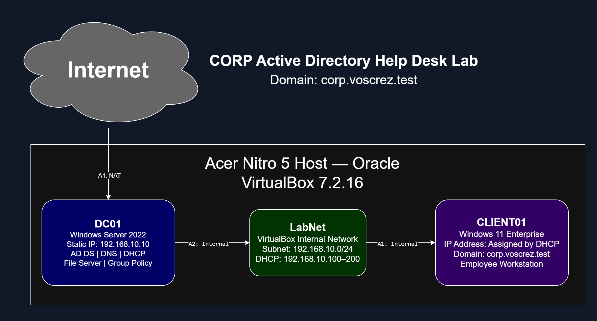
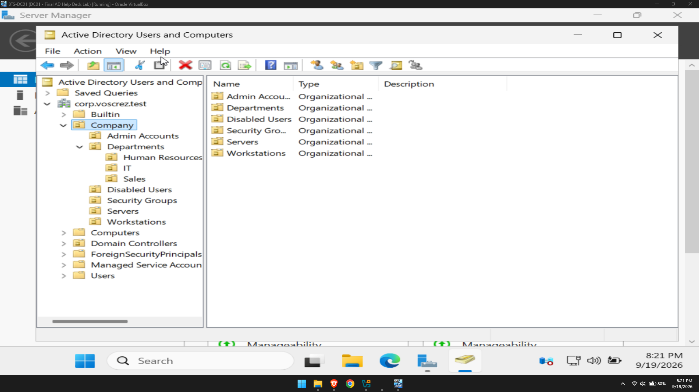
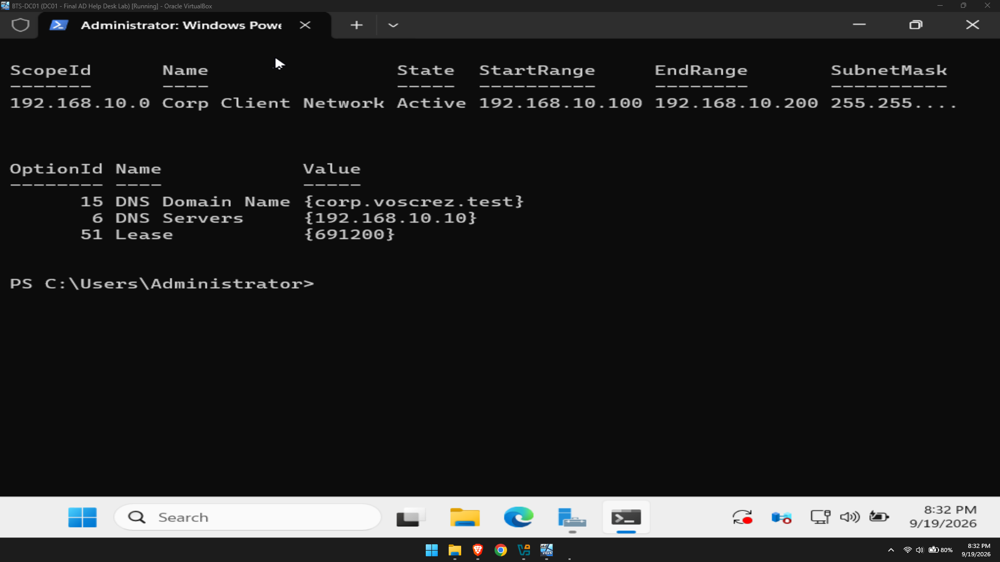
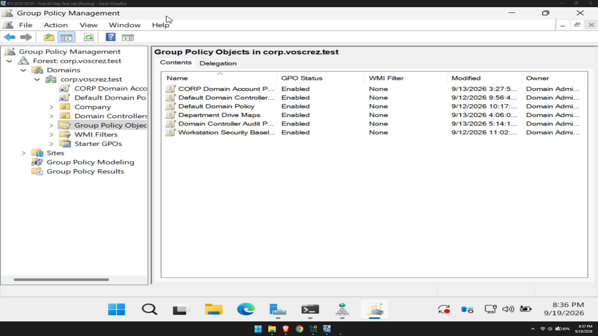
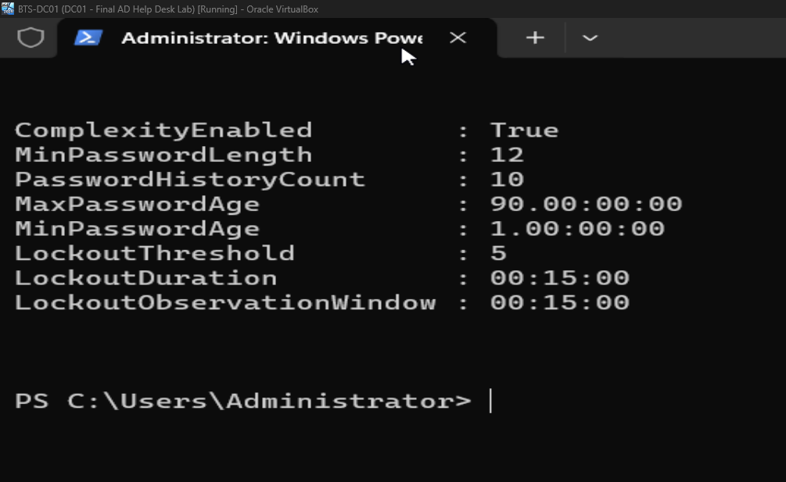
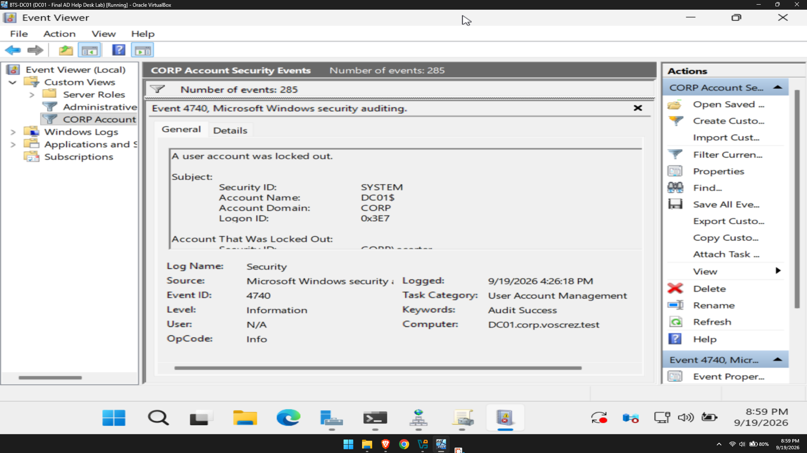
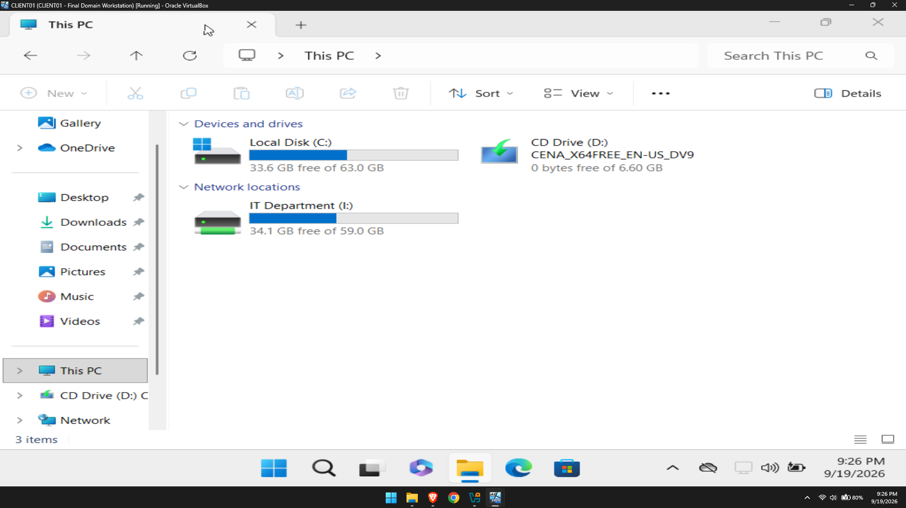
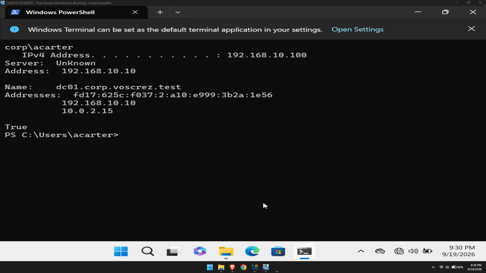
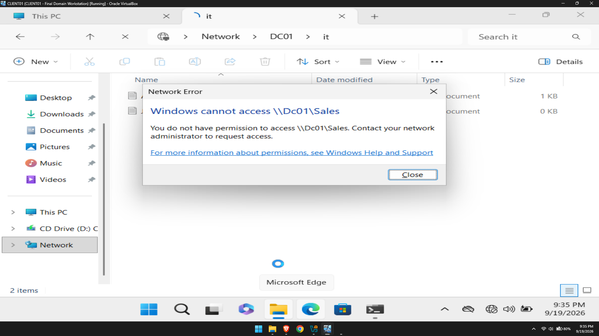

# Windows Server Active Directory Help Desk Lab

This project documents an enterprise-style Windows domain that I built in Oracle VirtualBox to practice real entry-level IT support and Windows system administration tasks. The lab includes a Windows Server 2022 domain controller, a Windows 11 domain workstation, centralized users and groups, DHCP, DNS, Group Policy, department file shares, delegated help desk permissions, security auditing, and troubleshooting.

> All company names, user accounts, and data in this repository are fictional and were created only for this home lab.

## Network Diagram



## Lab Environment

| Component | Configuration |
| --- | --- |
| Hypervisor | Oracle VirtualBox 7.2.16 |
| Domain controller | DC01 — Windows Server 2022 Evaluation |
| Client workstation | CLIENT01 — Windows 11 Enterprise |
| Active Directory domain | `corp.voscrez.test` |
| NetBIOS domain | `CORP` |
| Internal network | `LabNet` — `192.168.10.0/24` |
| DC01 internal address | `192.168.10.10` |
| DHCP pool | `192.168.10.100–192.168.10.200` |
| DC01 roles | AD DS, DNS, DHCP, Group Policy, and SMB file services |

DC01 uses one NAT adapter for outside connectivity and one internal adapter for LabNet. CLIENT01 uses only the internal LabNet adapter and receives its configuration from DC01.

## Project Objectives

- Deploy a Windows Server domain controller and create a new forest.
- Join a Windows 11 workstation to the domain.
- Build an organized OU structure for departments, computers, groups, administrators, and disabled users.
- Manage the complete employee account lifecycle: onboarding, password support, department transfers, and offboarding.
- Assign access through security groups instead of directly granting permissions to individual users.
- Configure DHCP, DNS, Group Policy, department file shares, and mapped drives.
- Delegate limited password-reset and account-unlock rights to a Tier 1 help desk account.
- Configure auditing and review security events in Event Viewer.
- Diagnose real lab failures using a repeatable troubleshooting process.

## Active Directory Design

The directory was divided into organizational units for:

- IT
- Human Resources
- Sales
- Workstations
- Servers
- Security Groups
- Admin Accounts
- Disabled Users

I created global department groups such as `GG_IT_Users` and resource groups such as `DL_IT_Share_RW`. This group-based design makes access easier to manage: users join the correct job-role group, and the group receives permission to the resource.

## Services and Policies Configured

### Active Directory and DNS

- Created the `corp.voscrez.test` forest and promoted DC01 to a domain controller.
- Used DC01 as the internal DNS server for domain name resolution.
- Verified name resolution with `nslookup` and tested the client trust relationship with `Test-ComputerSecureChannel`.

### DHCP

- Installed and authorized the DHCP Server role.
- Created an active scope for `192.168.10.100–192.168.10.200`.
- Distributed the internal DNS server and domain suffix to clients.
- Verified the DHCP service, scope, authorization, adapter binding, and firewall rules.

### Group Policy

- Workstation security baseline and corporate logon notice.
- Department drive mappings.
- Domain password and account-lockout policy.
- Domain controller security auditing.

The domain account policy requires 12-character complex passwords, remembers 10 previous passwords, and locks an account after five failed attempts for 15 minutes.

### File Shares and Access Control

- Created IT, HR, and Sales SMB shares.
- Applied share and NTFS permissions through department security groups.
- Verified that authorized users could reach their department drive.
- Verified that unauthorized users received an access-denied message.

### Delegated Help Desk Administration

I created a separate help desk administrator account and delegated only the permissions needed to reset passwords, require a password change at next sign-in, and unlock department users. The account was intentionally not added to Domain Admins, demonstrating least privilege.

### Security Auditing

I enabled success and failure auditing for:

- Credential validation
- User account management
- Security group management
- Account lockouts
- Logon activity
- Directory service changes
- Kerberos authentication

I also created a custom Event Viewer view for important account-security events, including account creation, disablement, group membership changes, password resets, lockouts, unlocks, and Kerberos failures.

## Help Desk Scenarios Completed

| Scenario | Work performed |
| --- | --- |
| New employee onboarding | Created the user in the proper OU, assigned a temporary password, required a password change, and added the correct department group. |
| Password reset and lockout | Verified the request, reset the password, required a new password at next sign-in, and unlocked the account. |
| Department transfer | Removed the old department group, moved the user to the new OU, added the new group, and verified updated drive access. |
| Employee offboarding | Disabled the account and moved it to Disabled Users instead of deleting it, preserving company records and files. |
| File-share access denied | Checked group membership and permissions, corrected the access assignment, and tested the result from CLIENT01. |
| Missing RSAT tools | Confirmed the capability state, installed the Active Directory RSAT feature, restarted, and verified the tools. |
| DHCP/APIPA failure | Traced a `169.254.x.x` address to failed DHCP communication and verified the service, binding, scope, authorization, firewall, and VirtualBox network path before restoring DHCP. |

[View detailed help desk ticket case studies](Documentation/Tickets)

## Troubleshooting Commands Used

```powershell
ipconfig /all
ipconfig /release
ipconfig /renew
nslookup dc01.corp.voscrez.test
Test-ComputerSecureChannel
gpupdate /force
Get-Service DHCPServer
Get-DhcpServerv4Binding
Get-DhcpServerv4Scope
Get-DhcpServerInDC
Get-SmbShare
Get-SmbShareAccess
auditpol /get /category:*
```

My troubleshooting process was to identify the symptom, collect evidence, test one layer at a time, make one controlled change, verify the result from both the server and client, and document what fixed the problem.

## Selected Evidence

### Active Directory OU Structure



### DHCP Scope and Options



### Group Policy Overview



### Password and Lockout Policy



### Account Security Events



### Department Drive Mapping



### Client Domain Connectivity



### Least-Privilege Access Test



[View all lab screenshots](Documentation/Screenshots)

## Skills Demonstrated

- Windows Server 2022 administration
- Active Directory Domain Services
- DNS and DHCP configuration
- Windows 11 domain joining and client support
- Group Policy administration
- User, group, and OU management
- SMB shares and NTFS permissions
- Least-privilege delegation
- Event Viewer and Windows security auditing
- PowerShell administration
- Help desk documentation and structured troubleshooting

## Lessons Learned

- Active Directory depends heavily on working DNS.
- Group-based permissions are easier to audit and maintain than direct user permissions.
- A successful ping proves network reachability, but DHCP, DNS, authentication, and Group Policy must still be tested separately.
- Disabling an offboarded account preserves records while immediately blocking normal access.
- Clear screenshots, diagrams, and ticket notes turn technical work into evidence that another technician can understand.

## Future Improvements

- Add a second domain controller for redundancy.
- Automate common account tasks with PowerShell.
- Deploy Windows LAPS for local administrator password management.
- Configure server backup and practice an Active Directory restore.
- Forward Windows events to a SIEM for alerting and investigation.

